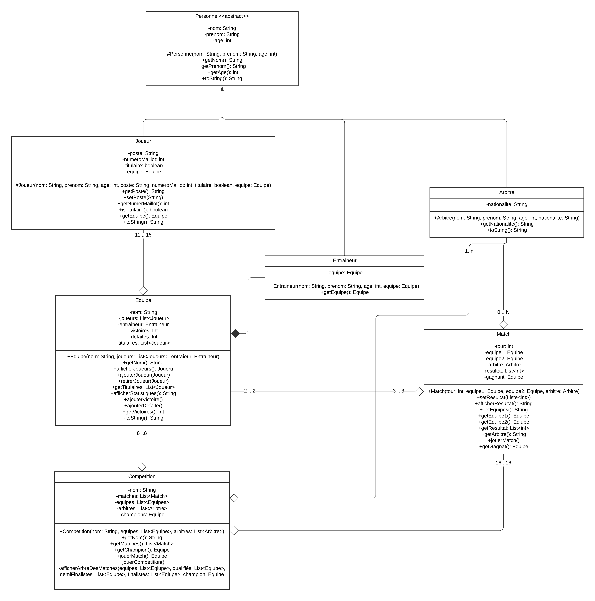
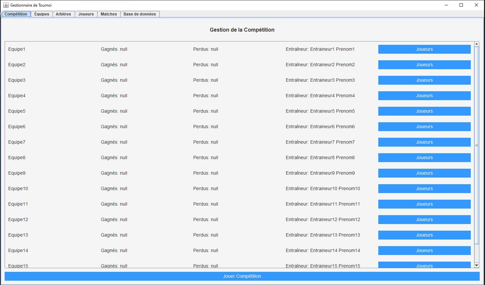
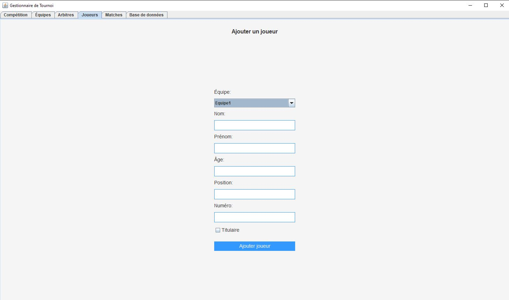
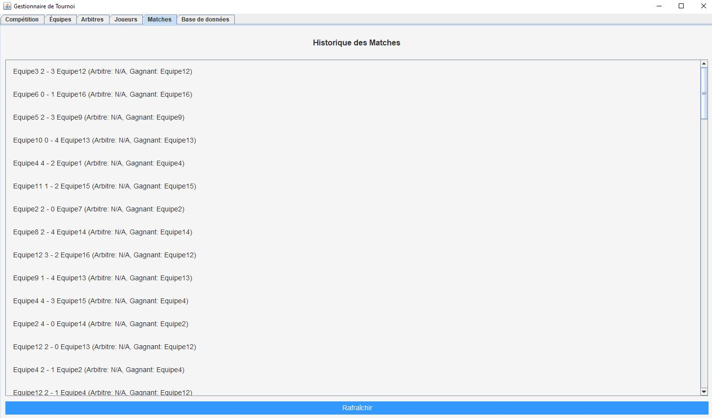
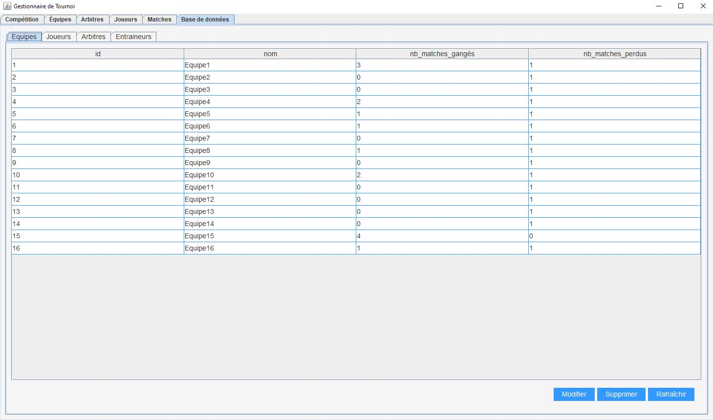

# Gestionnaire de Tournoi

## Description

Ce projet est un gestionnaire de tournoi développé en Java. Il permet de gérer les compétitions, les équipes, les joueurs, les arbitres, et les matchs. Le projet inclut une interface graphique pour faciliter l'interaction avec l'utilisateur, ainsi qu'une base de données SQLite pour stocker les informations. Le gestionnaire de tournoi est conçu pour être simple et intuitif, tout en offrant des fonctionnalités de base pour la gestion d'un tournoi sportif.

### UML du Projet



## Auteur

- **Nom** : Cherif Jebali
- **Date** : 8/12/2024

## Contexte

Ce projet a été développé dans le cadre du cours de Programmation Orientée Objet (POO) à l'Université Paris Dauphine. L'objectif était de mettre en pratique les concepts de POO en développant une application Java complète. Le projet a été réalisé par une seule personne et à pris 3 semaines pour être complété. Touefois, il reste des améliorations à apporter pour le rendre plus robuste et fonctionnel.
Il est important de noter que ce projet est un prototype. Il a été développé à des fins pédagogiques et pour démontrer les compétences en programmation Java, en base de données et en interface graphique.

## Technologies

- **Java** : Langage de programmation utilisé pour le développement de l'application.
- **Swing** : Bibliothèque graphique Java pour la création de l'interface utilisateur.
- **SQLite** : Système de gestion de base de données utilisé pour stocker les informations.
- **Maven** : Outil de gestion de dépendances utilisé pour la gestion des dépendances du projet.

## Screenshots

### Compétitions



### Équipes


### Joueurs



### Historique des Matchs



### Base de Données



## Fonctionnalités

- **Gestion des Équipes** : Ajouter, modifier et supprimer des équipes.
- **Gestion des Joueurs** : Ajouter, modifier et supprimer des joueurs.
- **Gestion des Arbitres** : Ajouter, modifier et supprimer des arbitres.
- **Historique des Matchs** : Afficher l'historique de tous les matchs.
- **Base de Données** : Consulter la base de données pour les informations stockées.

## Installation

### Prérequis

- Java Development Kit (JDK) 11 ou supérieur
- SQLite
- Maven (optionnel)

### Instructions

1. Clonez le dépôt GitHub :

    ```bash
    git clone https://github.com/[VotreNomUtilisateur]/gestionnaire-de-tournoi.git
    ```

2. Importez le projet dans votre IDE préféré (Eclipse, IntelliJ IDEA, etc.).

3. Assurez-vous que le JDK est correctement configuré dans votre IDE.

4. Exécutez le fichier `MainFrame.java` pour lancer l'application.

## Structure du Projet

- `src/main/java` : Contient le code source Java.
  - `main` : Contient la classe principale `MainFrame` pour l'interface utilisateur.
  - `panels` : Contient les classes pour les différents panneaux de l'interface.
  - `database` : Contient les classes pour la gestion de la base de données.
  - `model` : Contient les classes de modèle pour les compétitions, équipes, joueurs, etc.
  - `utils` : Contient les classes utilitaires pour le style et autres fonctions auxiliaires.

## Utilisation

### Interface Utilisateur

- **Compétitions** : Permet d'afficher les equipes, leurs joueurs et de lancer la compétition.
- **Équipes** : Permet d'ajouter, modifier et supprimer des équipes.
- **Arbitres** : Permet d'ajouter, modifier et supprimer des arbitres.
- **Joueurs** : Permet d'ajouter, modifier et supprimer des joueurs.
- **Matchs** : Permet de consulter l'historique des matchs.
- **Base de données** : Permet de consulter la base de données.

### Exemple d'Utilisation

1. **Créer une Compétition** :
    - Allez dans l'onglet "Compétitions".
    - Si vous ne possédez pas 16 équipes, ajoutez-en pour commencer la compétition.
    - Cliquez sur "Lancer Compétition" pour commencer la compétition.

2. **Ajouter une Équipe** :
    - Allez dans l'onglet "Équipes".
    - Cliquez sur "Ajouter Équipe".
    - Entrez les informations de l'équipe et validez.

3. **Ajouter un Joueur** :
    - Allez dans l'onglet "Joueurs".
    - Cliquez sur "Ajouter Joueur".
    - Entrez les informations du joueur et validez.

4. **Ajouter un Arbitre** :
    - Allez dans l'onglet "Arbitres".
    - Cliquez sur "Ajouter Arbitre".
    - Entrez les informations de l'arbitre et validez.

5. **Consulter l'Historique des Matchs** :
    - Allez dans l'onglet "Matchs".
    - Vous pouvez consulter l'historique de tous les matchs.

6. **Consulter la Base de Données** :
    - Allez dans l'onglet "Base de données".
    - Vous pouvez consulter les informations stockées dans la base de données.
    - Vous pouvez également modifier ou supprimer des informations.

## Structure de la Base de Données

Le projet utilise SQLite pour la gestion de la base de données. Les tables principales incluent :

- `competitions` : Stocke les informations sur les compétitions.
- `equipes` : Stocke les informations sur les équipes.
- `joueurs` : Stocke les informations sur les joueurs.
- `arbitres` : Stocke les informations sur les arbitres.
- `matchs` : Stocke les informations sur les matchs.

## Contribution

Les contributions sont les bienvenues ! Si vous souhaitez contribuer, veuillez suivre les étapes suivantes :

1. Forkez le dépôt.
2. Créez une branche pour votre fonctionnalité (`git checkout -b feature/ma-fonctionnalite`).
3. Commitez vos modifications (`git commit -am 'Ajout de ma fonctionnalité'`).
4. Poussez votre branche (`git push origin feature/ma-fonctionnalite`).
5. Créez une Pull Request.

## Licence

Ce projet est sous licence MIT. Voir le fichier [LICENSE](LICENSE) pour plus de détails.

## Contact

Si vous avez des questions, n'hésitez pas à me contacter à l'adresse suivante : [cherifjebali0301@gmail.com](mailto:cherifjebali0301@gmail.com).
